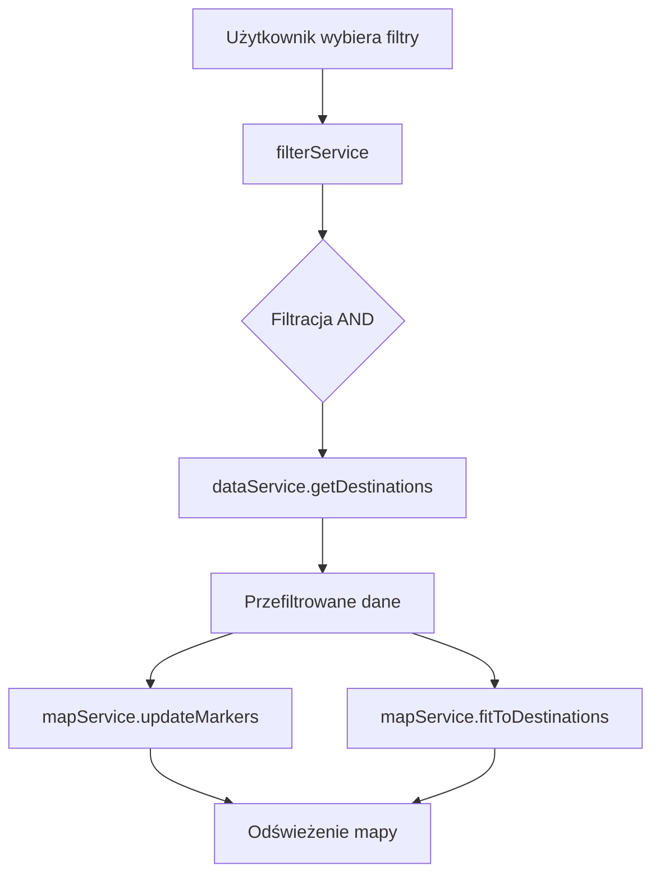
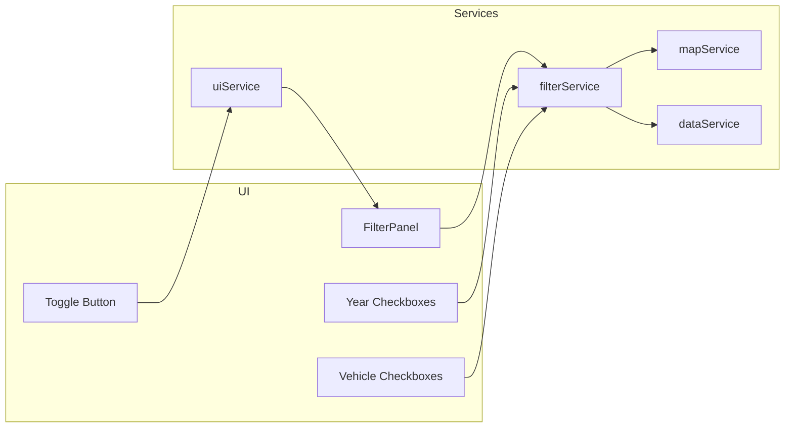

# Plan Implementacji Panelu Filtrów Wycieczek

## Przegląd
Dodanie panelu filtrów po lewej stronie mapy do filtrowania wycieczek po latach i środkach transportu.

## Wymagania
- ✅ Panel po lewej stronie
- ✅ Filtrowanie po latach (dynamicznie pobierane z danych)
- ✅ Filtrowanie po środkach transportu (plane, train, car)
- ✅ Estetyczny wygląd pasujący do stylistyki strony
- ✅ Przycisk do zwinięcia/rozwinięcia panelu
- ✅ Domyślnie panel rozwinięty
- ✅ Filtracja AND (wszystkie kryteria muszą być spełnione)

## Architektura

### Diagram przepływu danych



### Diagram struktury komponentów



## Szczegółowy Plan Implementacji

### 1. Nowe typy w `src/types/index.ts`

Dodaj interfejsy dla stanu filtrów:

```typescript
export interface FilterState {
  years: string[];
  vehicleTypes: VehicleType[];
}

export interface FilterOptions {
  years: string[];
  vehicleTypes: VehicleType[];
}
```

### 2. Nowy serwis `src/services/filterService.ts`

Utwórz nowy serwis odpowiedzialny za:
- Inicjalizację panelu filtrów
- Pobieranie unikalnych lat z danych
- Filtrowanie wycieczek (logika AND)
- Obsługę zdarzeń zmiany filtrów
- Obsługę zwijania/rozwijania panelu

### 3. Aktualizacja `src/services/uiService.ts`

Dodaj metody do zarządzania panelem filtrów:
- `toggleFilterPanel()` - przełączanie widoczności panelu
- `updateFilterPanel(state)` - aktualizacja stanu checkboxów
- `getFilterPanelElement()` - pobranie elementu panelu

### 4. Aktualizacja `src/services/mapService.ts`

Dodaj metodę:
- `updateMarkers(destinations)` - aktualizacja znaczników na mapie po filtrowaniu

### 5. Aktualizacja `src/app/app.ts`

Zintegruj panel filtrów z główną aplikacją:
- Inicjalizacja filterService
- Obsługa zdarzeń zmiany filtrów
- Aktualizacja znaczników po zmianie filtrów

### 6. HTML w `public/index.html`

Dodaj strukturę panelu filtrów:

```html
<!-- Filter Panel -->
<div id="filterPanel" class="filter-panel">
  <button id="toggleFilterBtn" class="toggle-filter-btn">
    <span id="toggleIcon">◀</span>
  </button>
  <div class="filter-content">
    <h3 class="filter-title">Filtry</h3>
    
    <div class="filter-section">
      <h4 class="filter-section-title">Lata</h4>
      <div id="yearFilters" class="filter-checkboxes"></div>
    </div>
    
    <div class="filter-section">
      <h4 class="filter-section-title">Środki transportu</h4>
      <div id="vehicleFilters" class="filter-checkboxes"></div>
    </div>
    
    <button id="resetFiltersBtn" class="reset-filters-btn">Resetuj filtry</button>
  </div>
</div>
```

### 7. Style CSS w `public/styles.css`

Dodaj style dla panelu filtrów pasujące do stylistyki strony:
- Kolorystyka: biały (#ffffff), niebieski (#3b82f6), szary (#4b5563)
- Font: Inter
- Animacje płynne
- Responsywność
- Efekt blur (backdrop-filter) dla spójności z innymi elementami

### 8. Szczegóły implementacji

#### Logika filtrowania AND:
```typescript
filterDestinations(destinations: Destination[], filters: FilterState): Destination[] {
  return destinations.filter(dest => {
    const yearMatch = filters.years.length === 0 || 
                      filters.years.some(year => dest.date.includes(year));
    const vehicleMatch = filters.vehicleTypes.length === 0 || 
                         filters.vehicleTypes.includes(dest.type);
    return yearMatch && vehicleMatch;
  });
}
```

#### Dynamiczne pobieranie lat:
```typescript
extractYears(destinations: Destination[]): string[] {
  const years = destinations.map(dest => {
    const match = dest.date.match(/\d{4}/);
    return match ? match[0] : '';
  }).filter(year => year !== '');
  return [...new Set(years)].sort();
}
```

#### Ikony środków transportu:
- ✈️ Plane (samolot)
- 🚆 Train (pociąg)
- 🚗 Car (samochód)

## Priorytety zadań

1. **Wysoki priorytet**: Nowe typy, filterService, HTML, CSS
2. **Średni priorytet**: Aktualizacja uiService, mapService
3. **Niski priorytet**: Testowanie, optymalizacje

## Zależności

- filterService zależy od: dataService, uiService
- app.ts zależy od: filterService
- mapService wymaga nowej metody updateMarkers

## Testowanie

Po implementacji sprawdzić:
- ✅ Panel wyświetla się poprawnie po lewej stronie
- ✅ Lata są dynamicznie pobierane z danych
- ✅ Checkboxy działają poprawnie
- ✅ Filtracja AND działa poprawnie
- ✅ Przycisk zwijania/rozwijania działa
- ✅ Reset filtrów działa
- ✅ Responsywność na urządzeniach mobilnych
- ✅ Styl pasuje do reszty strony
